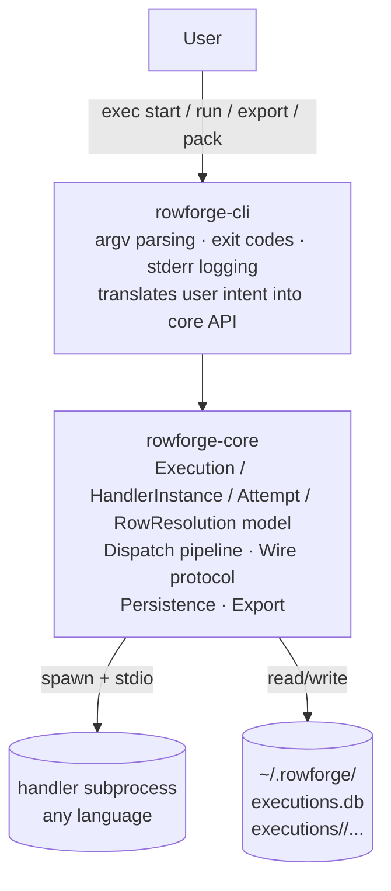

# Part I — Introduction

> Corresponds to §1. For the directory index see [README.md](README.md).

---

## 1. What rowforge is

### 1.1 One-sentence definition

> rowforge is a CLI tool that runs a user-supplied **handler** subprocess against every row of an input CSV/JSONL, dispatches rows over a JSON-Lines stdio protocol, and persists per-row results across multiple **Attempt**s so that already-successful rows are never re-dispatched on retry.

### 1.2 System view

### 1.3 Who should read what

| Reader | Suggested path |
|---|---|
| New contributor | Part I, then Part II and Part V |
| Maintainer changing dispatch | Part III (§4-5), Part VI (I + C invariants) |
| Maintainer changing persistence | Part IV (§8-9), Part VI (I7-I10) |
| Handler author | Part III (§5-6), Part IV (§7) |
| AI making code changes | Skim Part II, then Part VI full invariant list + the section nearest the change |

### 1.4 Out of scope

The following are explicitly outside what this spec defines for rowforge:

- GUI. rowforge is CLI only.
- Per-handler trust / signing / sandboxing.
- Automatic handler compilation (`entry.build` is informative only).
- Output schema enforcement for handler output (rowforge writes what the handler says, nothing more).
- Cross-execution row sharing or forked execution trees.

---

[← README](README.md) · Next: [Part II — Conceptual Model](part-2-model.md)
