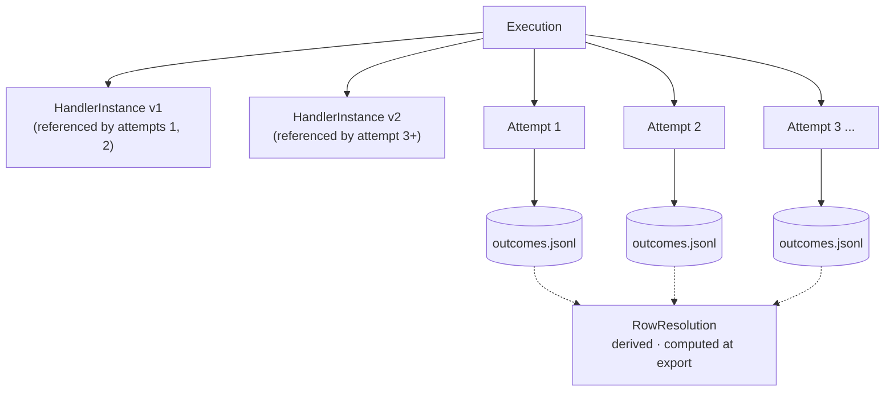
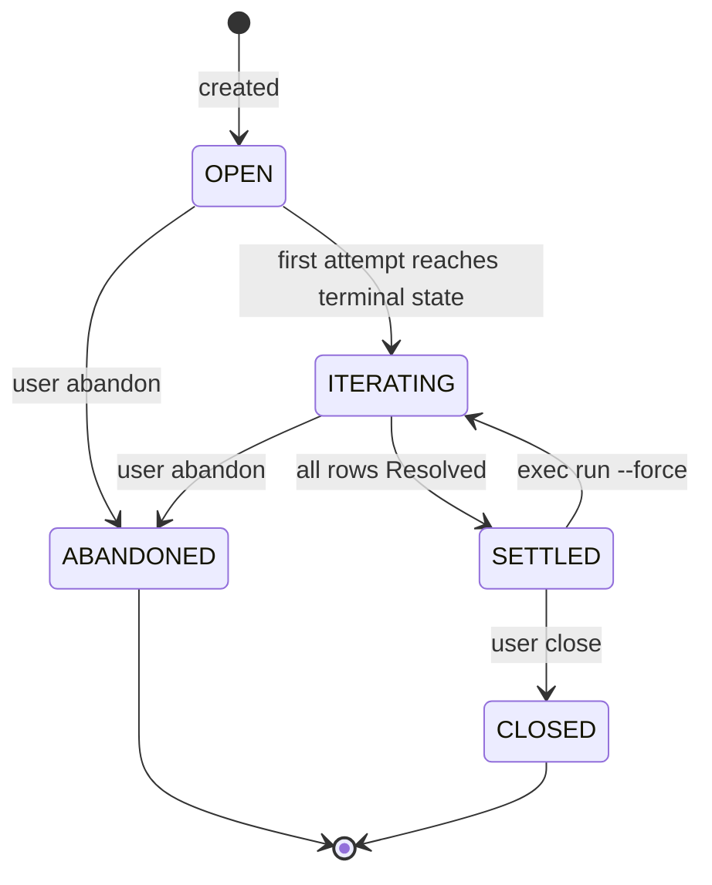
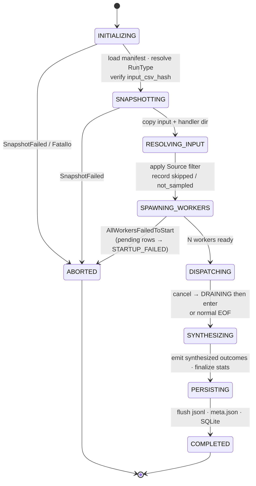

# Part II — Conceptual Model

> Corresponds to §2-3. For the directory index see [README.md](README.md).

---

## 2. Core concepts

The model consists of five concepts. Four are persisted; one (RowResolution) is derived.

### 2.1 Handler

A **Handler** is a user-supplied executable that reads JSON-Lines from stdin and writes JSON-Lines to stdout, processing one row (or one batch) per exchange. Handlers live in a directory that contains a `rowforge.yaml` manifest (§6, see [part-3-runtime.md](part-3-runtime.md)).

Handlers are **not** persisted as first-class entities. They exist only as files on disk. What rowforge persists is a content-addressed **snapshot** of a handler at a point in time — a HandlerInstance (§2.4).

### 2.2 Execution

An **Execution** is the scope for one complete processing lifecycle of an input CSV. It owns:

- An immutable snapshot of the input file (`input.csv` or `input.jsonl`).
- A SHA-256 computed at creation time; never recomputed after that.
- A pointer to the current HandlerInstance (the most recently used handler version).
- A time-ordered list of Attempts.
- A lifecycle state (§3.1).

Identifier: `e_<ULID>`. The input is **immutable** for the lifetime of the Execution — invariant **I1** (see [part-6-base.md](part-6-base.md)).

### 2.3 Attempt

An **Attempt** is one physical dispatch of (a subset of) rows from an Execution against a specific HandlerInstance. It owns:

- An append-only `outcomes.jsonl` recording per-row results.
- A `meta.json` describing the Attempt's RunType, statistics, and terminal state.
- A `handler-snapshot/` directory.
- A per-attempt copy of the input file.

Identifier: `r_<ULID>`. Attempts are **append-only**: once the lifecycle reaches a terminal state (§3.2), its outcomes are final.

### 2.4 HandlerInstance

A **HandlerInstance** is an immutable content-addressed snapshot of a handler at a point in time. It is identified by the triple `(handler_name, manifest_hash, source_snapshot_dir)`. Registering the same content twice returns the same instance — invariant **I3**.

Identifier: `hi_<ULID>`. Source files live in the `handler-snapshot/` directory of the Attempt that consumes it; the SQLite row only stores the content address and creation time.

### 2.5 RowResolution

**RowResolution** is the per-row derived state across all completed and aborted Attempts of an Execution. It is **never persisted**. It is recomputed from scratch each time it is needed — by traversing each Attempt's `outcomes.jsonl` and folding outcomes by `seq`.

The resolution state enum is small (§3.3). The folding rule is SUCCESS-absorbing — invariant **I5**.

### 2.6 Hierarchy



| Layer | Mutability |
|---|---|
| Execution | `input.csv` immutable; handler pointer and attempt list may grow |
| HandlerInstance | Immutable, content-addressed |
| Attempt | Immutable once terminal state is reached |
| RowResolution | Recomputed on every read |

---

## 3. State machines

### 3.1 Execution lifecycle



| State | Entry condition | Allowed transitions | New attempts allowed? |
|---|---|---|---|
| **OPEN** | Created | → ITERATING (on first attempt terminal state), → ABANDONED | Yes |
| **ITERATING** | attempts ≠ [] ∧ ∃ unresolved row | → SETTLED, → ABANDONED | Yes |
| **SETTLED** | All rows Resolved | → CLOSED, → ITERATING (only via `exec run --force`) | Yes, requires `--force` |
| **CLOSED** | User explicitly closed from SETTLED | Terminal | No |
| **ABANDONED** | User explicitly abandoned with reason | Terminal | No |

The persisted `state` column is a cache. Ground truth is RowResolution + lifecycle markers (§9, see [part-4-data.md](part-4-data.md)). rowforge MUST recompute and write back `state` after every attempt completion and after every user state command — invariant **I7**.

SETTLED is auto-detected when an attempt ends with `unresolved_count == 0`. CLOSED and ABANDONED require explicit user action.

### 3.2 Attempt lifecycle (phase machine)

Every attempt traverses the same phases. RunType (§4.5, see [part-3-runtime.md](part-3-runtime.md)) only affects what each phase does, not which phases exist.



#### Terminal state classification

| Terminal | Condition |
|---|---|
| **COMPLETED** | Phase reached `DISPATCHING` and at least one worker was ready; no fatal IO errors. Even if cancel fired, the in-flight batch drained gracefully. |
| **ABORTED** | Never reached `DISPATCHING` (worker spawn failed, snapshot died, fatal IO, or all workers crashed before producing any outcome). |

#### Abort reasons

```rust
enum AbortReason {
    SnapshotFailed,
    AllWorkersFailedToStart,
    CancelBeforeAnyRow,
    Stalled(Duration),         // stall monitor fired
    FatalIo(String),
}
```

Both COMPLETED and ABORTED attempts contribute outcomes to RowResolution (§9.1, see [part-4-data.md](part-4-data.md)). Only attempts still in `RUNNING` state are skipped.

### 3.3 Row resolution states

Derived per row.

| State | Condition | Reversible? |
|---|---|---|
| **NeverAttempted** | No attempt has dispatched this seq | Yes (next attempt may dispatch it) |
| **Resolved** | Some attempt produced a SUCCESS outcome for this seq | No, unless `--force` |
| **FailedLast** | The latest outcome is a handler-emitted error code | Yes |
| **CrashedLast** | The latest outcome is `WORKER_CRASH` or `WORKER_CRASH_UNSAFE` | Yes |
| **CancelledLast** | The latest outcome is `CANCELLED` (synthesized, see §5.4). Reserved; currently unreachable per cancel invariant C5. | Yes |
| **TooLarge** | The latest outcome is `ROW_TOO_LARGE` | No (requires editing the input file, which would violate I1) |

Folding rule (formalized in §9.1): a SUCCESS in any attempt is absorbing; the canonical SUCCESS is the **earliest** one in time. All other states fold to the latest non-success outcome.

---

[← README](README.md) · Previous: [Part I](part-1-overview.md) · Next: [Part III](part-3-runtime.md)
