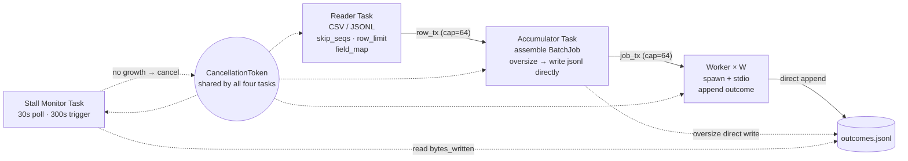

# Part III — Runtime Contracts

> Corresponds to §4-6. For the directory index see [README.md](README.md).

---

## 4. Dispatch pipeline

The pipeline executes within the `DISPATCHING` phase of an Attempt. It is **streaming**: reading rows, assembling batches, and dispatching proceed concurrently; no phase waits for a previous phase to finish.

### 4.1 Tasks and channels

Four concurrent tasks share one `CancellationToken` and one `SharedJsonlWriter` (appending to `outcomes.jsonl`).



Three channels (`row_tx`, `job_tx`, stdio). Four tasks. One outcome file. No writer task, no reorder buffer, no pause gate.

#### Channel capacities (normative)

| Channel | Capacity |
|---|---|
| Reader → Accumulator (`row_tx`) | 64 |
| Accumulator → Workers (`job_tx`) | 64 |

Stall monitor poll interval = 30 s; trigger = no growth in `outcomes.jsonl` for 300 consecutive seconds.

### 4.2 Per-task contracts

**Reader.** Streams rows from the input file. Applies `skip_seqs` (derived from resolution), `row_limit` (from `--sample`), and `field_map` (top-level key renames only). Produces one `RowJob` per valid row. Sends must be cancel-aware (§4.4 C6).

**Per-row parse error tolerance (v3.4 D13)**: Rows with CSV column-count mismatch or invalid JSONL JSON are logged at WARN and skipped — the pipeline is not aborted. Skipped rows appear as `NeverAttempted` in the next Attempt's RowResolution.

**Accumulator.** Receives `RowJob`s, assembles `BatchJob`s per §4.3 rules, and sends them downstream. On cancel, rows still buffered internally are **dropped** — they appear as `NeverAttempted` in the next Attempt's RowResolution (§4.4 C3).

**Worker(s).** Pulls `BatchJob`s from `job_tx`. Each worker owns one handler subprocess. Processing per batch:

1. Send to handler stdio (`row` or `batch` envelope, see §5.2).
2. Receive response (`result` / `error` / `batch_result`).
3. Assemble `BatchOutcome { first_seq, seqs, outcomes }`.
4. Append the outcome to `outcomes.jsonl` via `SharedJsonlWriter`, **before** pulling the next batch — invariant **I4**.

**Stall Monitor.** Polls `jsonl.bytes_written` every 30 s. If no growth for 300 consecutive seconds, calls `cancel.cancel()`. On normal completion the pool explicitly calls `cancel.cancel()` to wake the monitor for a clean exit rather than waiting out the full 300 s.

### 4.3 Batch boundaries

The manifest declares `runtime.mode = row | batch`. In row mode each BatchJob holds exactly one row; in batch mode the accumulator flushes on any of the following:

| Trigger | Default | Behavior |
|---|---|---|
| `runtime.batch_size` (row count) | — (required when `mode=batch`) | Normal flush |
| `runtime.batch_bytes_target` (soft byte cap) | 4 MiB | Early flush + WARN |
| `runtime.max_batch_bytes` (hard byte cap) | 16 MiB | Flush before exceeding |
| `ROW_HARD_CAP_BYTES` (per-row hard cap) | 4 MiB | Row written directly to `outcomes.jsonl` as `ROW_TOO_LARGE`; worker never sees it |

The per-row hard cap is a constant (not a manifest field). A row that exceeds this cap after serialization is permanently TooLarge — it never reaches a worker, and the same input will produce the same result on retry.

### 4.4 Cancellation

All four tasks share one `CancellationToken`. Cancel sources:

| Source | When |
|---|---|
| Operator (Ctrl-C / SIGINT) | CLI main loop calls `token.cancel()` |
| Stall Monitor | `outcomes.jsonl` has not grown for 300 consecutive seconds |
| Task error | Any task returns `Err` and propagates cancel |
| Normal completion | After Reader + Accumulator + Workers all return Ok, the pool calls `token.cancel()` (to wake the monitor) |

Cancel invariants:

| ID | Statement |
|---|---|
| **C1** | Before exiting, a Worker MUST write all outcomes for the current in-flight batch to `outcomes.jsonl`. |
| **C2** | The Accumulator discards pending rows on cancel; these rows are **not** synthesized as `CANCELLED` outcomes. |
| **C3** | Rows that were pending but not yet dispatched appear as `NeverAttempted` in the next Attempt's RowResolution. The next Attempt will re-dispatch them automatically. |
| **C4** | The Stall Monitor MUST exit on cancel — it MUST NOT continue polling after cancel fires. |
| **C5** | The dispatch pipeline MUST NOT emit synthesized `CANCELLED` outcomes (§5.4). That code is reserved for a possible future SDK contract where the handler signals active cancellation. |
| **C6** | Every bounded `mpsc::Sender::send().await` call MUST be wrapped in `tokio::select!` with a cancel arm. When the channel is full and cancel fires, no task may block indefinitely. |

C2 / C3 / C5 together formalize "the dispatch pipeline only writes what the handler said; nothing else is fabricated" — invariant **I8** (see [part-6-base.md](part-6-base.md)).

### 4.5 RunType axes

Each Attempt has two orthogonal RunType axes.

```rust
struct RunType {
    source: Source,
    simulation: Simulation,
}

enum Source {
    Full,                              // dispatch all rows (minus skip_seqs)
    Sampled { size: u32 },             // dispatch the first N unresolved rows
}

enum Simulation {
    Real,                              // meta.dry_run = false
    Dry,                               // meta.dry_run = true; handler decides whether to skip side effects
}
```

`skip_seqs` is always derived from `compute_resolution` at Attempt start, independent of Source. The computation depends on CLI flags (see §10.1 `exec run`):

| Flag | skip_seqs contains | Semantics |
|---|---|---|
| (default, no flag) | All already-Attempted seqs | One-shot: each row dispatched at most once |
| `--retry-failed` | All seqs except failure classes (`FailedLast` / `CrashedLast` / `CancelledLast` / `TooLarge`) | Dispatch failures only |
| `--force` | Empty set | Re-dispatch everything |

`Sampled { size }` counts **after** subtracting `skip_seqs` — issuing `--sample 3` against an Execution where 8 of 10 rows are already Attempted dispatches at most 2 rows.

The `Simulation` axis only sets `meta.dry_run` on each dispatched row. Core does not change its behavior based on this. The handler reads `ctx.DryRun` and decides whether to skip side effects.

The manifest's `runtime.idempotent` flag (§6) is read at Attempt start; the dispatch pipeline does not embed it in RunType, but it affects crash outcome synthesis (§5.4: `WORKER_CRASH` vs `WORKER_CRASH_UNSAFE`).

---

## 5. Wire protocol

### 5.1 Framing

- Transport: handler subprocess stdin / stdout.
- Framing: JSON-Lines. One JSON object per line. Lines terminated with `\n`.
- Encoding: UTF-8. No BOM.
- Handler stderr is **not** parsed by rowforge — it is forwarded to rowforge's own stderr at INFO level for operator observation.

Both directions tolerate **unknown fields** (at the object level, forward-compatible). Both directions tolerate **unknown envelope types** (line is ignored, bidirectionally forward-compatible).

### 5.2 Envelope directory

#### App → Handler

```jsonc
// First message after spawn.
{"type":"init",
 "run_id":"r_01HX...",
 "config":{...},                // merged from manifest.config + CLI --config
 "meta":{"columns":["billid","contact_id"]}}

// Row-mode dispatch (runtime.mode = row, or batch with batch_size=1).
{"type":"row",
 "seq":7,
 "data":{"billid":"B12"},
 "meta":{"dry_run":false,"row_index":7}}

// Batch-mode dispatch (runtime.mode = batch).
{"type":"batch",
 "rows":[
   {"seq":0,"data":{"billid":"B1"},"meta":{"dry_run":false,"row_index":0}},
   {"seq":1,"data":{"billid":"B2"},"meta":{"dry_run":false,"row_index":1}}
 ]}

// End of run. Handler must drain in-flight work and exit within the grace period (5 s).
{"type":"shutdown"}
```

#### Handler → App

```jsonc
// First message after consuming init. Must precede any result/error.
{"type":"ready","handler_version":"0.4.0"}

// Row-mode response: one envelope per row.
{"type":"result","seq":7,"data":{"is_valid":true,"domain":"x.com"}}
{"type":"error", "seq":7,"code":"INVALID","message":"missing @",
 "data":{"billid":"B12"}}                     // data is optional

// Batch-mode response: one envelope per batch, positionally aligned to rows.
{"type":"batch_result","results":[
   {"kind":"result","data":{"is_valid":true}},
   {"kind":"error","code":"INVALID","message":"missing @",
    "data":{"billid":"B12"}}
 ]}
```

### 5.3 Handshake

```mermaid
sequenceDiagram
    participant App as rowforge App
    participant H as handler subprocess

    App->>H: spawn
    App->>H: {"type":"init", run_id, config, meta}
    Note over H: Must reply ready within manifest.entry.startup_timeout_ms<br/>(default 30s);<br/>otherwise worker → STARTUP_FAILED.<br/>All STARTUP_FAILED → attempt ABORTED
    H-->>App: {"type":"ready","handler_version":"..."}

    loop dispatch loop
        App->>H: {"type":"row" | "batch", ...}
        H-->>App: {"type":"result" | "error" | "batch_result", ...}
    end

    App->>H: {"type":"shutdown"}
    App->>H: close stdin
    Note over App,H: 5s grace for handler to exit;<br/>otherwise SIGTERM → SIGKILL
    H-->>App: process exit
```

### 5.4 Error code directory

#### Handler-emitted (in `error` / `batch_result.error`)

Any string is accepted. Convention is `SCREAMING_SNAKE`. Examples: `INVALID`, `DNS_TIMEOUT`, `NOT_FOUND`, `EMPTY_FAIL_FIELDS`. rowforge does not enforce a vocabulary.

#### Synthesized (written to `outcomes.jsonl` by rowforge)

The following codes are produced by rowforge when the handler did not or could not emit an outcome. These codes are reserved — handlers MUST NOT emit them.

| Code | When produced | Idempotent? |
|---|---|---|
| `WORKER_CRASH` | Worker process exits or stdout EOF while a batch is in flight; manifest declares `runtime.idempotent: true`. All rows in the in-flight batch receive this code. | Yes |
| `WORKER_CRASH_UNSAFE` | Same as above but `runtime.idempotent: false`. Semantically distinct: a retry may duplicate side effects. | No — handler must declare idempotent before safe retry |
| `ROW_TOO_LARGE` | Row exceeds `ROW_HARD_CAP_BYTES` (4 MiB) after serialization. Written by the Accumulator before reaching any worker. | n/a (permanent) |
| `STARTUP_FAILED` | All workers failed to emit `ready` within `startup_timeout_ms`. Pending rows are synthesized with this code; attempt → ABORTED. | Yes |
| `BATCH_PROTOCOL_ERROR` | Handler's `batch_result` is malformed, has missing entries, or has wrong length. All rows in that batch receive this code. | Yes |
| `MISSING_REQUIRED_INPUT_COLUMN` | Input is missing a column declared in `manifest.required_input`. Detected before SPAWNING_WORKERS; attempt → ABORTED. | Yes |
| `NEVER_ATTEMPTED` | Synthesized, **appears only in export output** (§9, see [part-4-data.md](part-4-data.md)), not in `outcomes.jsonl`. Marks rows that were never dispatched by any attempt. | Yes |

`CANCELLED` is a reserved code (see C5); it is never emitted.

### 5.5 Wire-layer invariants

| ID | Statement |
|---|---|
| **W1** | Every `result` / `error` envelope carries the `seq` of the corresponding `row` envelope. (Row mode only.) |
| **W2** | A `batch_result` response has the same length as its `batch.rows`. Entries are positionally aligned; MUST NOT carry a `seq` field. |
| **W3** | Handler MUST emit **exactly one** `ready` envelope before any `result` / `error` / `batch_result`. |
| **W4** | Handler MUST exit (or close stdout) within 5 s of receiving `shutdown`. Otherwise escalated to SIGTERM → SIGKILL. |
| **W5** | Both sides ignore unknown envelope types and unknown fields. |

---

## 6. Manifest

The `rowforge.yaml` file in the handler directory.

### 6.1 Top-level schema

```yaml
name: my-handler              # required, string
version: 0.1.0                # required, string
description: ""               # optional, string (decorative)
language: ""                  # optional, string; used by `pack`

entry:                        # required, object
  cmd: ["./bin/handler"]      # required, [string]
  build: ["..."]              # optional, [string]; informative (never auto-executed)
  cwd: "."                    # optional, string; default "."
  env: {}                     # optional, map<string,string>; default {}
  startup_timeout_ms: 30000   # optional, uint; default 30000

required_input: []            # optional, [string]; default []

config:                       # optional, map<string,ConfigField>
  timeout_ms: { default: 5000 }

runtime:                      # optional, object (see §6.3)

output:                       # optional, object
  include_meta: false         # default false
```

### 6.2 Required-input validation

If `required_input` is non-empty, rowforge checks at the start of `RESOLVING_INPUT`:

- **CSV input**: checks the header. Missing column → attempt aborts with `MISSING_REQUIRED_INPUT_COLUMN`.
- **JSONL input**: sniffs the top-level keys of the first row. Missing key → same code. Missing keys in subsequent rows are the handler's problem, not rowforge's.

### 6.3 Runtime block

```yaml
runtime:
  mode: row | batch              # required if this block is present; default row
  batch_size: 100                # required when mode=batch; 1..=10000
  idempotent: true | false       # required when mode=batch
  stateful: false                # optional; true forces worker count to 1
  batch_bytes_target: 4194304    # optional; default 4 MiB
  max_batch_bytes: 16777216      # optional; default 16 MiB
```

Validation rules (rejected at manifest load time):

| Rule | Failure mode |
|---|---|
| `mode=batch` AND `batch_size` not in 1..=10000 | Rejected |
| `mode=batch` AND `idempotent` missing | Rejected |
| `max_batch_bytes < ROW_HARD_CAP_BYTES` (4 MiB) | Rejected |
| `mode=row` with batch fields present | Accepted but ignored (forward-compatible) |

`stateful: true` forces the worker count to 1 regardless of CLI flags — intended for handlers that maintain in-memory state across rows.

### 6.4 Output block

```yaml
output:
  include_meta: false    # default
```

When `true`, the meta fields described in §7.4 / §9.2 (see [part-4-data.md](part-4-data.md)) are appended to the exported success / failed CSV+JSONL. When `false` (or omitted), those fields are absent.

### 6.5 Forward compatibility

- Unknown top-level fields are silently ignored.
- Unknown sub-object fields are silently ignored.
- The legacy `schema:` block (pre-v3.3 manifest) is silently ignored. `required_input` supersedes the old `schema.input.<key>.required` form.

### 6.6 What the manifest does not do

- No output schema allowlist. rowforge writes whatever keys the handler returns.
- No type validation of handler output.
- No automatic compilation. `entry.build` is documentation and `pack`-only.
- No trust / signature checks.
- No enforced handler error code vocabulary.

---

[← README](README.md) · Previous: [Part II](part-2-model.md) · Next: [Part IV](part-4-data.md)
